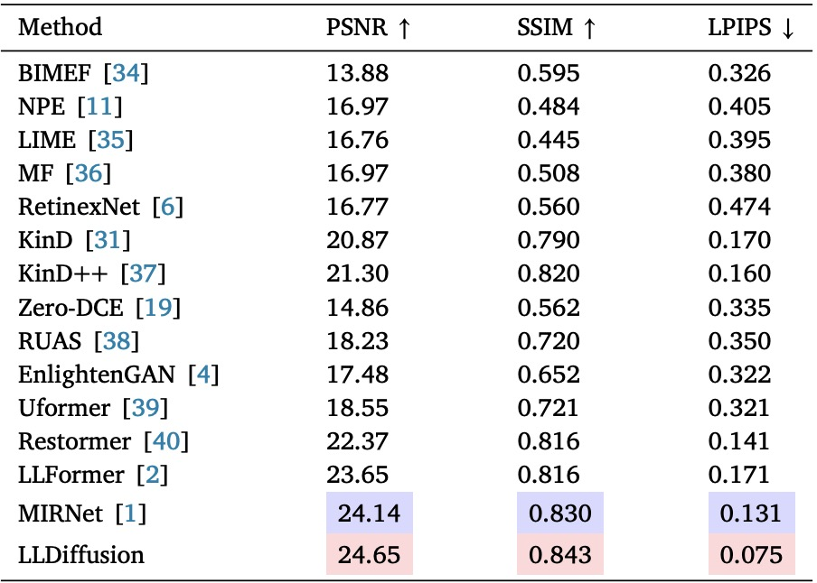
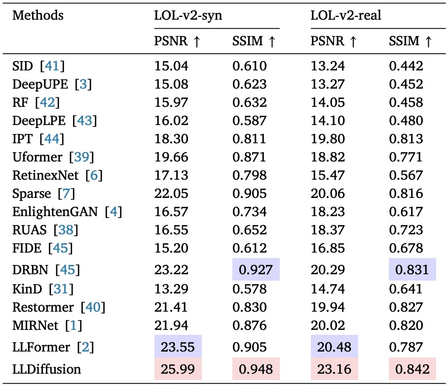
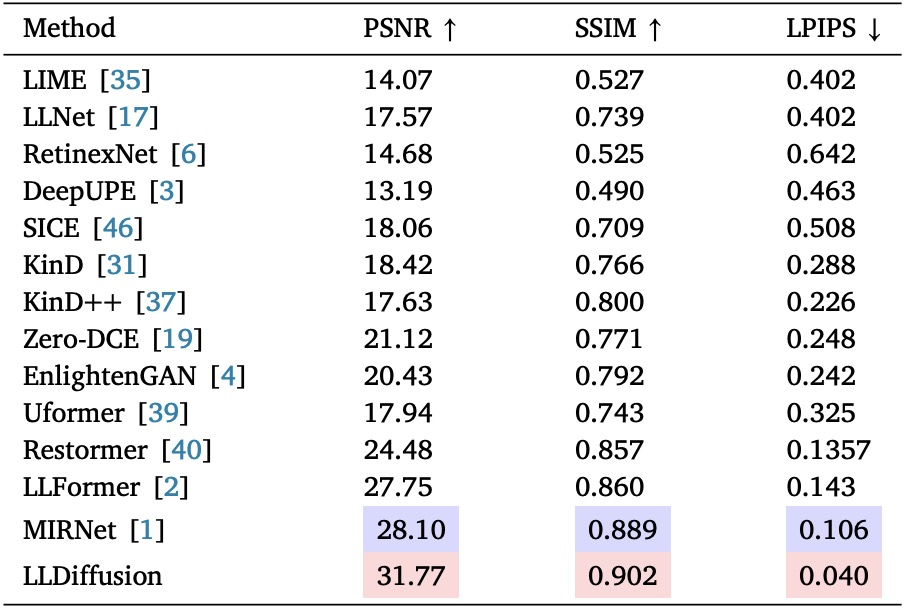
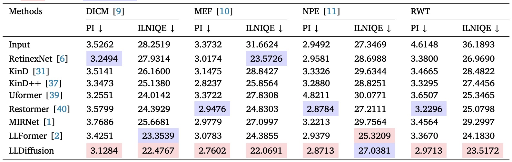

# LLDiffusion: Learning Degradation Representations in Diffusion Models for Low-Light Image Enhancement (PR 2025)

[Tao Wang](https://scholar.google.com/citations?user=TsDufoMAAAAJ&hl=en), [Kaihao Zhang](https://scholar.google.com/citations?user=eqwDXdMAAAAJ&hl=en), [Yong Zhang](https://yzhang2016.github.io/), [Wenhan Luo](https://scholar.google.com/citations?user=g20Q12MAAAAJ&hl=en), [Bjorn Stenger](https://scholar.google.com/citations?user=plhjgHUAAAAJ&hl=en), [Tong Lu](https://cs.nju.edu.cn/lutong/index.htm), [Tae-Kyun Kim](https://scholar.google.com.hk/citations?user=j2WcLecAAAAJ&hl=zh-CN), [Wei Liu](https://scholar.google.com.hk/citations?user=AjxoEpIAAAAJ&hl=zh-CN)

[](https://arxiv.org/pdf/2307.14659.pdf) 


#### News
- [2025/7/14] 🔥 Release our Real-world Tesing dataset for real-world LLIE!
- [2025/7/14] 🔥 Release the Pre trained models!
- [2025/7/14] 🔥 Release the codes!
- [2025/3/21] 🔥 Paper accepted at PR 2025
- [2023/7/27] 🔥 Paper on Arxiv


<!-- This repository contains the dataset, code and pre-trained models for our paper. Please refer to our [project page](https://taowangzj.github.io/projects/LLFormer/) for a quick project overview. -->

<hr />

>**Abstract:** *Current deep learning methods for low-light image enhancement (LLIE) typically rely on pixel-wise mapping learned from paired data. However, these methods often overlook the importance of considering degradation representations, which can lead to sub-optimal outcomes. In this paper, we address this limitation by proposing a degradation-aware learning scheme for LLIE using diffusion models, which effectively integrates degradation and image priors into the diffusion process, resulting in improved image enhancement. Our proposed degradation-aware learning scheme is based on the understanding that degradation representations play a crucial role in accurately modeling and capturing the specific degradation patterns present in low-light images. To this end, First, a joint learning framework for both image generation and image enhancement is presented to learn the degradation representations. Second, to leverage the learned degradation representations, we develop a Low-Light Diffusion model (LLDiffusion) with a well-designed dynamic diffusion module. This module takes into account both the color map and the latent degradation representations to guide the diffusion process. By incorporating these conditioning factors, the proposed LLDiffusion can effectively enhance low-light images, considering both the inherent degradation patterns and the desired color fidelity. Finally, we evaluate our proposed method on several well-known benchmark datasets, including synthetic and real-world unpaired datasets. Extensive experiments on public benchmarks demonstrate that our LLDiffusion outperforms state-of-the-art LLIE methods both quantitatively and qualitatively.*

<hr />


## Pipeline


## :wrench: Dependencies and Installation

1. The code requires `python>=3.7`, as well as `pytorch==2.0.1` and `torchvision==0.15.2`. Please follow the instructions [here](https://pytorch.org/get-started/locally/) to install both PyTorch and TorchVision dependencies. Installing both PyTorch and TorchVision with CUDA support is strongly recommended.

```bash
conda create -n LLDiffusion python=3.10.6
conda activate LLDiffusion
pip install torch==2.0.1 torchvision==0.15.2 torchaudio==2.0.2
pip install -r requirements.txt
```
2. Download the LOL, LOL-v2 dataset 

3. Extract file into folder `data/sets/lol` `data/sets/lol-v2-syn` `data/sets/lol-v2-real`

4. Download the checkpoints from our [Link](https://pan.baidu.com/s/1WH_QcFOeVS5W9f6e5mQ4HA?pwd=kfeh).

5. Download our proposed real-world LLIE dataset from our [Link]( https://pan.baidu.com/s/1nOFRNXolUW_stLmp80m7Wg?pwd=cpg9).

6. Clone Repo
```
git clone https://github.com/TaoWangzj/LLDiffusion.git
```

## Train

1. Train on LOL dataset 
```sh
python train.py --config configs/deg-unet.yml
```

2. Train on LOL-v2-real dataset 
```sh
python train.py --config configs/deg-unet-lol-v2-real.yml
```

3. Train on LOL-v2-synthetic dataset 
```sh
python train.py --config configs/deg-unet-lol-v2-sys.yml
```

# Test

1. Test on LOL dataset 
```sh
python test.py --config configs/deg-unet.yml --resume checkpoints/LOL/best-355-23.32.pth 
```
2. Test on LOL-v2-real dataset 
```sh
python test.py --config configs/deg-unet-lol-v2-real.yml --resume checkpoints/lol-v2-real/best-5499-24.10.pth
```
3. Test on LOL-v2-synthetic dataset 
```sh
python test.py --config configs/deg-unet-lol-v2-syn.yml --resume checkpoints/lol-v2-syn/best-3999-25.99.pth
```

## Results
Experiments are performed for different LLIE datasets including, LOL, VE-LOL, LOL-v2, and real-world LLIE datasets. 

<details>
<summary><strong>LOL dataset</strong> (click to expand) </summary>

 
</details>

<details>
<summary><strong>LOL-v2 dataset</strong> (click to expand) </summary>

 
<!-- <p align="center"></p> -->

</details>

<details>
<summary><strong>VE-LOL</strong> (click to expand) </summary>

 
</details>

<details>
<summary><strong>Real-world LLIE dataset</strong> (click to expand) </summary>

 
</details>

## Reference Repositories
This implementation is based on / inspired by:
- Restormer: https://github.com/swz30/Restormer
- WeatherDiffusion: https://github.com/IGITUGraz/WeatherDiffusion
- LLFormer: https://github.com/TaoWangzj/LLFormer

## Citations
If our work helps your research or work, please consider citing:

```
@article{wang2025lldiffusion,
  title={LLDiffusion: Learning degradation representations in diffusion models for low-light image enhancement},
  author={Wang, Tao and Zhang, Kaihao and Zhang, Yong and Luo, Wenhan and Stenger, Bj{\"o}rn and Lu, Tong and Kim, Tae-Kyun and Liu, Wei},
  journal={Pattern Recognition},
  volume={166},
  pages={111628},
  year={2025},
  publisher={Elsevier}
}
```
