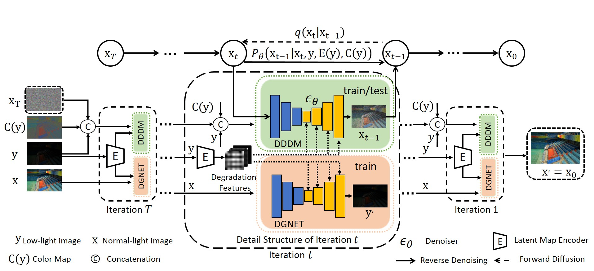

## LLDiffusion: Learning Degradation Representations in Diffusion Models for Low-Light Image Enhancement


[Tao Wang](https://scholar.google.com/citations?user=TsDufoMAAAAJ&hl=en), [Kaihao Zhang](https://scholar.google.com/citations?user=eqwDXdMAAAAJ&hl=en), [Ziqian Shao](), [Wenhan Luo](https://scholar.google.com/citations?user=g20Q12MAAAAJ&hl=en), [Bjorn Stenger](https://scholar.google.com/citations?user=plhjgHUAAAAJ&hl=en), [Tong Lu](https://cs.nju.edu.cn/lutong/index.htm), [Tae-Kyun Kim](https://scholar.google.com.hk/citations?user=j2WcLecAAAAJ&hl=zh-CN), [Wei Liu](https://scholar.google.com.hk/citations?user=AjxoEpIAAAAJ&hl=zh-CN), [Hongdong Li](https://scholar.google.com.hk/citations?user=Mq89JAcAAAAJ&hl=zh-CN)

[](https://arxiv.org/pdf/2307.14659.pdf)




>**Abstract:**
>Current deep learning methods for low-light image enhancement (LLIE) typically rely on pixel-wise mapping learned from paired data. However, these methods often overlook the importance of considering degradation representations, which can lead to sub-optimal outcomes. In this paper, we address this limitation by proposing a degradation-aware learning scheme for LLIE using diffusion models, which effectively integrates degradation and image priors into the diffusion process, resulting in improved image enhancement. Our proposed degradation-aware learning scheme is based on the understanding that degradation representations play a crucial role in accurately modeling and capturing the specific degradation patterns present in low-light images. To this end, First, a joint learning framework for both image generation and image enhancement is presented to learn the degradation representations. Second, to leverage the learned degradation representations, we develop a Low-Light Diffusion model (LLDiffusion) with a well-designed dynamic diffusion module. This module takes into account both the color map and the latent degradation representations to guide the diffusion process. By incorporating these conditioning factors, the proposed LLDiffusion can effectively enhance low-light images, considering both the inherent degradation patterns and the desired color fidelity. Finally, we evaluate our proposed method on several well-known benchmark datasets, including synthetic and real-world unpaired datasets. Extensive experiments on public benchmarks demonstrate that our LLDiffusion outperforms state-of-the-art LLIE methods both quantitatively and qualitatively. The source code and pre-trained models are available at https://github.com/TaoWangzj/LLDiffusion.

### TODO
- [ ] HuggingFace demo (If necessary)
- [ ] Release our Real-world Tesing dataset for real-world LLIE.  
- [ ] Release the Pre-trained models
- [ ] Release the codes
- [ ] Relase Homepage
- [x] ~~Paper on Arxiv~~ 

## Citations
If our work help your research or work, please consider citing:

```
@article{wang2023lldiffusion,
     title={LLDiffusion: Learning Degradation Representations in Diffusion Models for Low-Light Image Enhancement},
     author={Wang, Tao and Zhang, Kaihao, and Shao, Ziqian and Luo, Wenhan and Stenger, Bjorn and Lu, Tong and Kim, Tae-Kyun and 
        Liu, Wei and  Li, Hongdong },
     journal={arXiv preprint arXiv:2307.14659},
     year={2023}
    }
```


